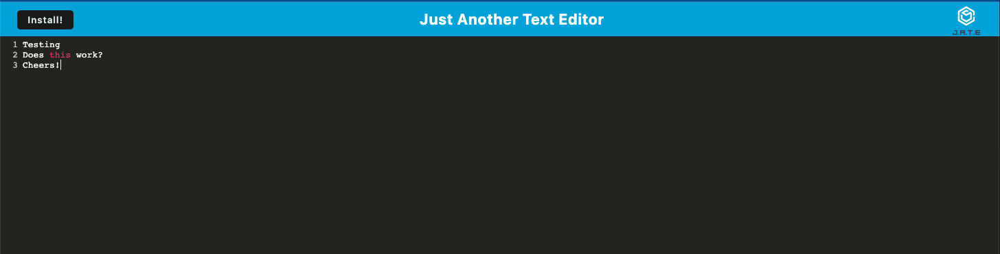
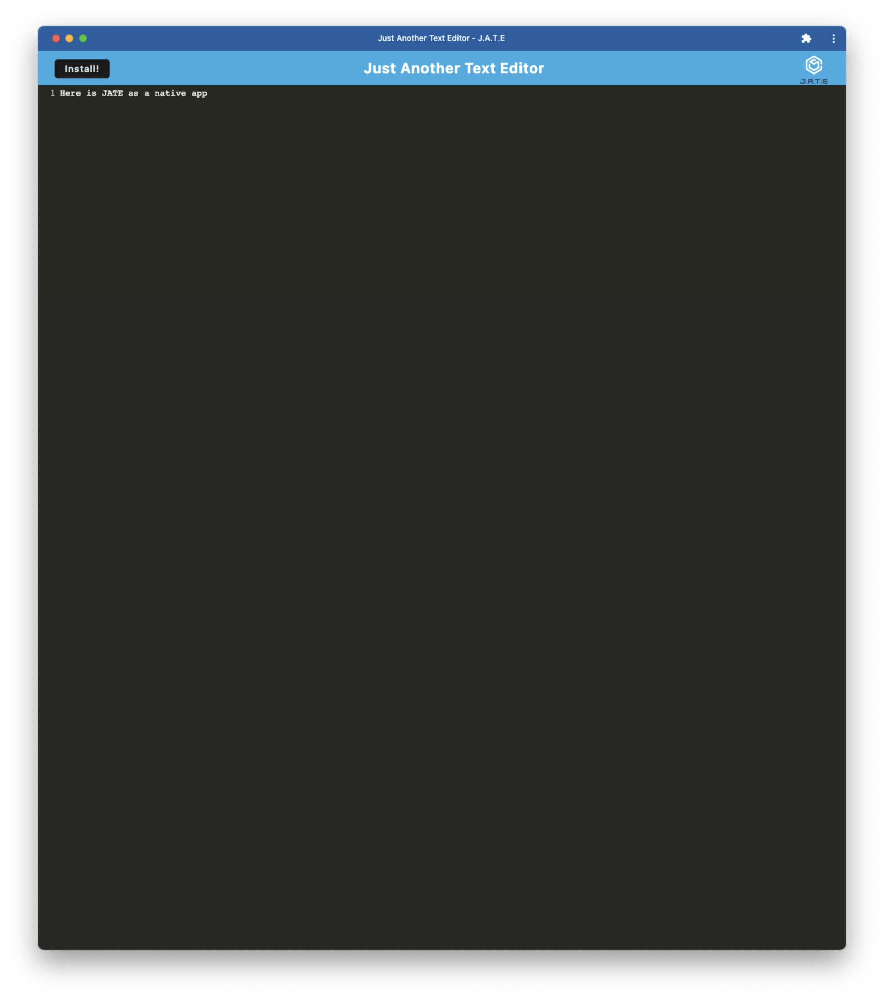

# just-another-text-editor
A text editor with syntax highlighting, that can also be installed as a native app.

## Description

I was motivated to create this project as a means to continue practicing with a client/server model, indexedDB and webpack. I built this app in order to create a way to save notes and code snippets, even when I don't have an internet connection. The biggest learning experience for me here was having the app save to the database, or local storage (when not connected to the internet) and then having it pull from either of those options to display the saved notes.

## Installation

The steps to install my project are as follows:

- Clone or fork my code from GitHub
- Install the required dependencies
- Run "npm run build" to start the servers

## Usage

This is an example of JATE working from the browser (Chrome):

This is an example of JATE working as a native app:

## License

MIT License

Copyright (c) 2023 Erich Z.

Permission is hereby granted, free of charge, to any person obtaining a copy of this software and associated documentation files (the "Software"), to deal in the Software without restriction, including without limitation the rights to use, copy, modify, merge, publish, distribute, sublicense, and/or sell copies of the Software, and to permit persons to whom the Software is furnished to do so, subject to the following conditions:

The above copyright notice and this permission notice shall be included in all copies or substantial portions of the Software.

THE SOFTWARE IS PROVIDED "AS IS", WITHOUT WARRANTY OF ANY KIND, EXPRESS OR IMPLIED, INCLUDING BUT NOT LIMITED TO THE WARRANTIES OF MERCHANTABILITY, FITNESS FOR A PARTICULAR PURPOSE AND NONINFRINGEMENT. IN NO EVENT SHALL THE AUTHORS OR COPYRIGHT HOLDERS BE LIABLE FOR ANY CLAIM, DAMAGES OR OTHER LIABILITY, WHETHER IN AN ACTION OF CONTRACT, TORT OR OTHERWISE, ARISING FROM, OUT OF OR IN CONNECTION WITH THE SOFTWARE OR THE USE OR OTHER DEALINGS IN THE SOFTWARE.

